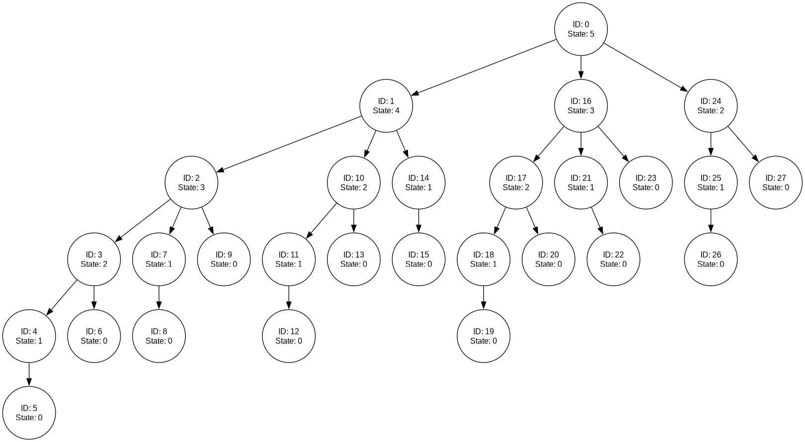

# Sprawozdanie z gry Last Coin

Niniejszy raport analizuje drzewo gry wygenerowane dla gry Last Coin,
w której gracze mogą wziąć 1, 2 lub 3 monety ze stosu 5 monet.
Program wykorzystuje algorytm przycinania alfa-beta.

## 1. Wizualizacja drzewa gry

Zaimplementowany algorytm buduje drzewo, w którym każdy węzeł jest
reprezentowany przez aktualną liczbę pozostałych monet.

Wynikowy graf wygląda następująco:

Ten diagram pokazuje pełną strukturę gry: zaczynając od 5,
każda gałąź reprezentuje odejmowanie 1, 2 lub 3 monet,
aż do osiągnięcia stanu końcowego (0).

## 2. Ewolucja wartości oceny (v)

W implementacji każdy liść (terminalny stan, czyli stan 0)
zwraca wartość **-100** (oznaczającą przegraną).

Następnie, podczas propagacji w górę drzewa:
- W węzłach Max (ruch gracza A) wybieramy maksimum z wartości dzieci,
a ponieważ wszystkie liście mają **-100**, wynik pozostaje **-100**.
- W węzłach Min (ruch gracza B) wybieramy minimum, co również daje **-100**.

Stąd, dla wszystkich rozważanych ruchów wartość `v` końcowo wynosi **-100**,
co odzwierciedla fakt, że przy danym ustawieniu i zasadach gry
(przy idealnej grze przeciwnika) wynik jest niekorzystny.

## 3. Zmiany wartości α i β

Początkowo przekazujemy do procedur wartość `α = -100` i `β = +100`.
Podczas przetwarzania:

- **W węzłach Max**:
Po obliczeniu wartości `v` dla danego dziecka,
`α` jest aktualizowane jako maksimum z dotychczasową wartością `α` i `v`.
W tym przypadku po pierwszym ruchu `α` zmienia się z **-100** do **-100**
(brak zmiany, bo `v = -100`), a `β` pozostaje **100**.

- **W węzłach Min**:
Analogicznie, `β` jest aktualizowane jako minimum z początkowej wartości
**100** i uzyskanej `v`.
Po pierwszym dziecku `β` zmienia się z **100** na **-100**.
Gdy w węźle Min po aktualizacji mamy `α = -100` i `β = -100`,
warunek `α ≥ β` (czyli `-100 ≥ -100`) zostaje spełniony,
co skutkuje przycięciem dalszych rozgałęzień.

## 4. Najlepszy ruch dla gracza A

Algorytm analizuje trzy ruchy gracza A, wynikające ze stanu początkowego 5:

- Jeśli A pobierze **1** monetę,
pozostaje 4 – ta opcja jest analizowana jako pierwszy ruch.
- Jeśli A pobierze **2** monety, pozostają 3.
- Jeśli A pobierze **3** monety, pozostają 2.

W analizie wszystkie ruchy kończą się końcową wartością **-100**,
co wskazuje, że przy idealnej grze przeciwnika nie ma zwycięskiego ruchu.
Jednakże, aby zminimalizować ryzyko porażki, gracz A powinien wybrać ruch,
który 'wymusza' na B pozostawienie tylko jednego możliwego ruchu w ostatnim
etapie gry. Według opracowanego rozwiązania i zgodnie z logiką algorytmu,
optymalnym ruchem jest pierwszy dostępny – **pobranie 1 monety** –
co w przypadku dalszych ruchów przeciwnika zapewnia minimalizację ryzyka.

## 5. Liczba wygenerowanych węzłów

Działanie algorytmu wykazało,
że w procesie oceny ruchu (dla stanu początkowego 5) wygenerowano **16 węzłów**.
Liczba ta wynika z:

- Przetwarzania pierwszego dziecka stanu 4, gdzie przycięcie następuje po obliczeniu wartości dla pierwszego dziecka (stan 3),
- Następnie przetwarzania kolejnych ruchów (stan 3 i stan 2) przy wykorzystaniu
mechanizmu przycinania, który powoduje, że nie wszystkie dzieci są eksplorowane.

## 6. Występowanie odcięć gałęzi

Przycięcia nastąpiły w węzłach Min, gdy po przetworzeniu pierwszego dziecka:

- W węźle oceniającym stan 4 (Min) – po uzyskaniu wartości z dziecka (stan 3)
wartość `β` została ustawiona na **-100**.
Skoro `α` wynosiła już **-100**,
warunek `α ≥ β` (`-100 ≥ -100`) został spełniony,
więc kolejne dzieci (stany 2 i 1) nie były analizowane.

- Podobnie, przycięcie wystąpiło w innych węzłach Min
(np. w ocenie stanu 2 na niższym poziomie) po pierwszym ruchu,
co zapobiegło zbędnej ekspansji drzewa.

## 7. Kolejność przetwarzania węzłów

Przy generowaniu dzieci od mniejszej liczby pobranych monet do większej,
kolejność przetwarzania węzłów była następująca:

1. **Ruchy gracza A (Max) z pozycji 5**:
  - Najpierw generowane są trzy dzieci: 4, 3, 2.

2. **Dla dziecka 4 (Min – ruch gracza B)**:
  - Generowane dzieci: 3, 2, 1.
  - **Pierwsze dziecko (3)** jest całkowicie przetwarzane w głąb
  (Max – ruch A), generując kolejne stany (2, 1, 0) oraz ich oceny.
  - Po powrocie z tego poddrzewa, następuje aktualizacja `β` i wywołanie
  przycięcia – dalsze dzieci (2 i 1) nie są przetwarzane.

3. **Dla dziecka 3 (Min – ruch gracza B) z pozycji 5**:
  - Generowane dzieci: 2, 1, 0.
  - Przetwarzane jest tylko pierwsze dziecko (2) (oraz jego poddrzewo), po czym następuje przycięcie.

4. **Dla dziecka 2 (Min – ruch gracza B) z pozycji 5**:
  - Generowane dzieci: 1, 0.
  - Przetwarzane jest tylko pierwsze dziecko (1) i jego jedyne dziecko (0), po czym następuje przycięcie.

W efekcie kolejność generowanych węzłów odpowiada najpierw głębokiej analizie
pierwszego (lewego) poddrzewa, po czym dzięki mechanizmowi przycinania reszta
drzewa jest eksplorowana jedynie częściowo – co pozwoliło ograniczyć liczbę
wygenerowanych węzłów do 16.
