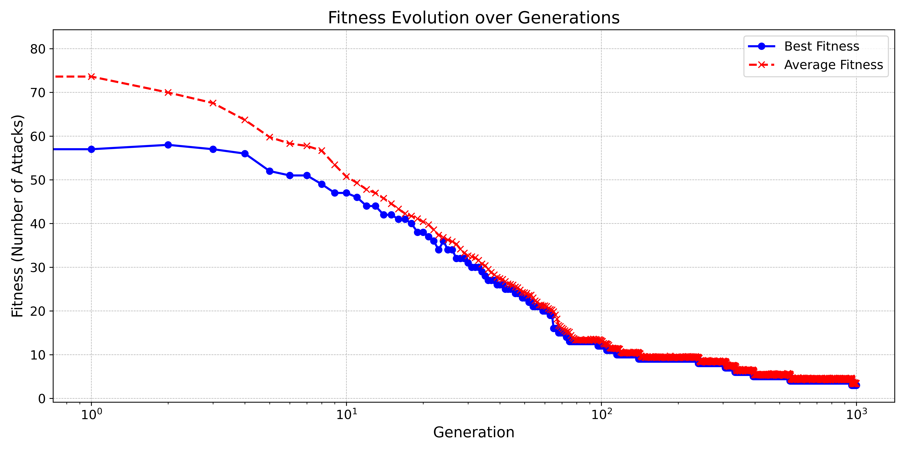

# N-Queens Solver - Evolutionary Algorithm

## Wyniki dla N = 50

Czas wykonania: 892.6828 ms
Liczba ataków: 3

Najlepsze rozwiązanie znaleziono po 1000 generacjach.

[Ustawienie na szachownicy](./assets/fitness_board.txt).

> Wykres zmienności wartości funkcji przystosowania.

## Eksperyment
